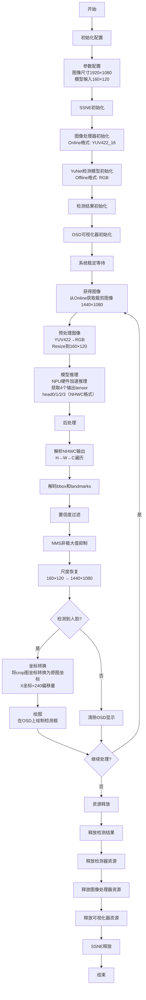

# SSNE AI 演示项目

## 项目概述

本项目是基于 SmartSens SSNE (SmartSens Neural Engine) 的 AI 演示程序，主要展示人脸检测功能。项目使用 C++ 开发，集成了图像处理、AI 模型推理和可视化显示等功能。

当前实现的是 **YuNet 三通道人脸检测模型**，支持 RGB 三通道输入。

## 重要说明

> **图像格式配置注意事项：**
> - **Online（图像采集）格式**: `SSNE_YUV422_16` (YUV422 16位)
> - **Offline（模型输入）格式**: `SSNE_RGB` (RGB三通道)
> - 如果模型输入需要 BGR 格式，请将 offline 的格式修改为 `SSNE_BGR`
>
> **模型输出格式注意事项：**
> - 模型经过工具链转换后，输出的 layout 统一为 **NHWC** 格式
> - 后处理代码必须按照 **NHWC** 格式进行数据解析
> - 遍历顺序：H (高度) → W (宽度) → C (通道)

## 文件结构

```
ssne_ai_demo/
├── demo_face_yunet.cpp        # 主演示程序 - YuNet三通道人脸检测演示
├── include/                   # 头文件目录
│   ├── common.hpp            # 公共数据结构定义（FaceDetectionResult、YUNET类）
│   ├── utils.hpp             # 工具函数声明（NMS、排序等）
│   └── osd-device.hpp        # OSD设备接口定义
├── src/                       # 源代码目录
│   ├── utils.cpp             # 工具函数实现（NMS、归并排序、FaceDetectionResult方法）
│   ├── pipeline_image.cpp    # 图像处理管道实现（Online配置）
│   ├── yunet.cpp             # YuNet人脸检测模型实现（三通道RGB输入）
│   └── osd-device.cpp        # OSD设备接口实现
├── app_assets/               # 应用资源
│   ├── models/              # AI模型文件
│   │   └── yunet_160x120.m1model  # YuNet人脸检测模型（160×120输入）
│   └── colorLUT.sscl        # 颜色查找表
├── cmake_config/            # CMake配置
│   └── Paths.cmake          # 路径配置文件
├── scripts/                 # 脚本文件
│   └── run.sh              # 运行脚本
├── CMakeLists.txt          # CMake构建配置文件
└── README.md              # 项目说明文档
```

## 核心文件说明

### 1. 主程序文件
- **demo_face_yunet.cpp**: YuNet三通道人脸检测主演示程序
  - 初始化SSNE引擎
  - 配置图像处理器和YuNet检测模型
  - 主循环处理图像帧
  - 坐标转换和可视化显示
  - 资源释放

### 2. 核心类定义
- **common.hpp**: 定义核心数据结构
  - `FaceDetectionResult`: 人脸检测结果结构体（支持关键点）
  - `IMAGEPROCESSOR`: 图像处理器类
  - `YUNET`: YuNet三通道人脸检测模型类

- **utils.hpp**: 工具函数声明
  - 检测结果排序和NMS处理函数
  - `VISUALIZER`: 可视化器类，用于绘制检测框

### 3. 实现文件
- **src/utils.cpp**: 通用工具函数实现
  - 归并排序算法
  - 非极大值抑制(NMS)
  - `FaceDetectionResult` 成员函数（Clear/Reserve/Resize/Free）
  - 可视化绘制功能

- **src/pipeline_image.cpp**: 图像处理管道
  - Online图像采集配置（YUV422_16格式）
  - 图像裁剪配置
  - Pipeline通道管理

- **src/yunet.cpp**: YuNet模型实现
  - 模型初始化和推理（RGB三通道输入）
  - 先验框(Priors)生成
  - **NHWC格式输出解析**：按H→W→C顺序遍历
  - 后处理算法（解码、置信度过滤、NMS）

- **src/osd-device.cpp**: OSD设备接口
  - 屏幕显示控制
  - 图形绘制功能

### 4. 配置文件
- **CMakeLists.txt**: 构建配置文件
  - 定义编译选项和依赖库
  - 指定源文件和头文件路径
  - 链接SSNE相关库

- **cmake_config/Paths.cmake**: 路径配置
  - SDK路径设置
  - 库文件路径配置

### 5. 资源文件
- **app_assets/models/yunet_160x120.m1model**: YuNet人脸检测AI模型
  - 输入尺寸: 160×120
  - 输入格式: RGB三通道
  - 输出: 4个head（loc/conf/iou），包含人脸边界框、关键点和置信度
  - 输出格式: **NHWC** layout

- **app_assets/colorLUT.sscl**: 颜色查找表
  - 用于OSD显示的颜色配置

### 6. 脚本文件
- **scripts/run.sh**: 运行脚本
  - 环境变量设置
  - 程序启动命令

## Demo 流程图

以下是完整的YuNet人脸检测流程：



### 流程说明

#### 1. 初始化配置 (`demo_face_yunet.cpp:24-74`)

- **参数配置** (`demo_face_yunet.cpp:29-35`)
  - 配置原图尺寸（1920×1080）
  - 配置模型输入尺寸（160×120）
  - 配置模型文件路径

- **SSNE初始化** (`demo_face_yunet.cpp:42-44`)
  - 初始化SSNE引擎

- **图像处理器初始化** (`demo_face_yunet.cpp:47-55`)
  - 初始化图像处理器，配置原始图像尺寸
  - 设置裁剪参数（1920×1080 → 1440×1080，左右各裁240px）
  - **Online格式**: `SSNE_YUV422_16`

- **YuNet检测模型初始化** (`demo_face_yunet.cpp:58-60`)
  - 初始化YuNet人脸检测模型
  - 加载模型文件
  - 生成先验框(priors)
  - **Offline格式**: `SSNE_RGB`（如需BGR请修改为`SSNE_BGR`）

- **检测结果初始化** (`demo_face_yunet.cpp:63`)
  - 分配检测结果存储空间

- **OSD可视化器初始化** (`demo_face_yunet.cpp:66-67`)
  - 初始化OSD可视化器，配置图像尺寸

- **系统稳定等待** (`demo_face_yunet.cpp:70-71`)
  - 等待系统稳定（0.2秒）

#### 2. 主处理循环

- **获得图像** (`demo_face_yunet.cpp:83`)
  - 从 Online Pipeline 获取裁剪后的图像（1440×1080）
  - 通过 `IMAGEPROCESSOR::GetImage()` 从 pipe0 获取图像数据
  - 图像格式：YUV422_16

- **预处理图像** (`src/yunet.cpp:398`)
  - 使用 `RunAiPreprocessPipe()` 将裁剪图 resize 到模型输入尺寸（160×120）
  - 进行 YUV422 → RGB 格式转换

- **模型推理** (`src/yunet.cpp:406-412`)
  - 调用 `ssne_inference()` 在NPU上执行模型推理
  - 通过 `ssne_getoutput()` 获取4个输出tensor（head0/1/2/3）
  - **输出格式为 NHWC**

- **后处理** (`src/yunet.cpp:446-458`)
  - **解析NHWC输出** (`yunet.cpp:157-166`): 按 H→W→C 顺序遍历输出数据
  - **解码bbox和landmarks** (`yunet.cpp:225-288`): 从 loc/conf/iou 解码检测结果
  - **置信度过滤** (`yunet.cpp:308-326`): 去除置信度低于阈值的检测框
  - **NMS** (`yunet.cpp:330`): 非极大值抑制，去除重叠的检测框
  - **尺度恢复** (`yunet.cpp:336-347`): 将坐标从160×120恢复到1440×1080

- **判断是否有检测框** (`demo_face_yunet.cpp:91`)
  - 检查后处理结果中是否存在检测到的人脸框
  - 如果有检测框，执行坐标转换和绘图
  - 如果没有检测框，清除OSD显示

- **坐标转换** (`demo_face_yunet.cpp:95-113`)
  - 仅在检测到人脸时执行
  - 将crop图（1440×1080）的坐标转换为原图（1920×1080）坐标
  - X坐标加上裁剪偏移量240

- **绘图** (`demo_face_yunet.cpp:118`, `src/utils.cpp`)
  - 仅在检测到人脸时执行
  - 调用 `VISUALIZER::Draw()` 在OSD显示层绘制检测框
  - 支持多个检测框的同时绘制
  - 未检测到人脸时，清除OSD上的检测框显示

#### 3. 资源释放 (`demo_face_yunet.cpp:134-142`)

- **释放检测结果** (`demo_face_yunet.cpp:134`)
  - 释放检测结果占用的内存

- **释放检测器资源** (`demo_face_yunet.cpp:135`)
  - 释放模型和tensor资源

- **释放图像处理器资源** (`demo_face_yunet.cpp:136`)
  - 关闭pipeline通道

- **释放可视化器资源** (`demo_face_yunet.cpp:137`)
  - 释放OSD设备资源

- **SSNE释放** (`demo_face_yunet.cpp:139-142`)
  - 释放SSNE引擎资源

## 数据流说明

本项目的图像处理流程分为两个主要部分：**在线处理（Online Processing）** 和 **离线处理（Offline Processing）**，通过不同的pipeline协同工作，实现高效的AI推理。

### 1. 在线处理（Online Processing）- IMAGEPROCESSOR

在线处理主要在 `IMAGEPROCESSOR` 类中完成，负责从传感器获取图像并进行实时预处理：

#### 图像格式配置
> **重要**: Online使用 `SSNE_YUV422_16` 格式

#### 初始化阶段
```cpp
// 在 IMAGEPROCESSOR::Initialize 中
format_online = SSNE_YUV422_16;              // 图像格式：YUV422 16位
OnlineSetCrop(kPipeline0, 240, 1680, 0, 1080);  // 设置裁剪参数：左右各裁240px
OnlineSetOutputImage(kPipeline0, format_online, 1440, 1080);  // 输出裁剪后的图像尺寸
OpenOnlinePipeline(kPipeline0);              // 打开pipe0通道
```
**接口说明：**
- **OnlineSetCrop**: 设置图像裁剪参数，定义裁剪区域边界
  - 函数声明：`int OnlineSetCrop(PipelineIdType pipeline_id, uint16_t x1, uint16_t x2, uint16_t y1, uint16_t y2);`
  - 参数说明：
    - `pipeline_id`: pipeline标识（kPipeline0/kPipeline1）
    - `x1`: 左边界坐标（包含）
    - `x2`: 右边界坐标（不包含）
    - `y1`: 上边界坐标（包含）
    - `y2`: 下边界坐标（不包含）
  - 返回值：0表示设置成功，-1表示设置异常
  - 约束条件：最大宽度8192像素，最大高度8192像素，最小高度1像素
  - 注意：裁剪尺寸需要与输出图像尺寸匹配

- **OnlineSetOutputImage**: 设置输出图像参数，包括尺寸和数据类型
  - 函数声明：`int OnlineSetOutputImage(PipelineIdType pipeline_id, uint8_t dtype, uint16_t width, uint16_t height);`
  - 参数说明：
    - `pipeline_id`: pipeline标识（kPipeline0/kPipeline1）
    - `dtype`: 输出图像数据类型（`SSNE_YUV422_16`）
    - `width`: 输出图像宽度（像素）
    - `height`: 输出图像高度（像素）
  - 返回值：0表示设置成功，-1表示设置异常
  - 约束条件：最大宽度8192像素，最大高度8192像素，最小高度1像素
  - 注意：输出尺寸需要与Crop的尺寸匹配

- **OpenOnlinePipeline**: 打开并初始化指定的pipeline通道
  - 函数声明：`int OpenOnlinePipeline(PipelineIdType pipeline_id);`
  - 参数说明：
    - `pipeline_id`: pipeline标识（kPipeline0/kPipeline1）
  - 返回值：0表示打开成功，-1表示打开异常
  - 功能特点：初始化Image_Capture模块，准备数据传输


#### 图像获取阶段
```cpp
// 在 GetImage 函数中
GetImageData(img_sensor, kPipeline0, kSensor0, 0);  // 从pipe0获取图像数据
```
**接口说明：**
- **GetImageData**: 从指定pipeline获取当前帧图像数据
  - 函数声明：`int GetImageData(ssne_tensor_t *image, PipelineIdType pipeline_id, SensorIdType sensor_id, bool get_owner);`
  - 参数说明：
    - `image`: 输出tensor，存储获取的图像数据
    - `pipeline_id`: pipeline标识（kPipeline0/kPipeline1）
    - `sensor_id`: 传感器标识（kSensor0/kSensor1）
    - `get_owner`: 是否获取数据所有权
  - 返回值：0表示获取成功，-1/-2表示获取异常
  - 功能特点：如果当前帧无数据则等待，超过等待时间返回异常

#### 资源释放阶段
```cpp
// 在 IMAGEPROCESSOR::Release 中
CloseOnlinePipeline(kPipeline0);  // 关闭pipe0（裁剪图像通道）
```

**接口说明：**
- **CloseOnlinePipeline**: 关闭指定的pipeline通道并重置默认参数
  - 函数声明：`int CloseOnlinePipeline(PipelineIdType pipeline_id);`
  - 参数说明：
    - `pipeline_id`: pipeline标识（kPipeline0/kPipeline1）
  - 返回值：0表示关闭成功，-1表示关闭异常
  - 功能特点：释放相关资源，重置为默认状态

### 2. 离线处理（Offline Processing）- YUNET

离线处理在 `YUNET` 类中完成，主要负责AI模型的输入准备和推理。整个离线处理流程包括预处理管道的获取、图像预处理执行以及资源释放。

#### 图像格式配置
> **重要**: Offline使用 `SSNE_RGB` 格式
> 
> 如果模型输入需要 BGR 格式，请将代码中的 `SSNE_RGB` 修改为 `SSNE_BGR`

#### 预处理管道获取
```cpp
// 在 common.hpp 中
AiPreprocessPipe pipe_offline = GetAIPreprocessPipe();  // 获取离线预处理管道
```
**接口说明：**
- **GetAIPreprocessPipe**: 创建并获取AI预处理管道句柄
  - 函数声明：`AiPreprocessPipe GetAIPreprocessPipe();`
  - 参数说明：无参数
  - 返回值：AiPreprocessPipe结构体变量，用于后续的图像预处理操作
  - 功能特点：初始化AI预处理管道，为离线图像处理做准备

#### 模型输入准备
```cpp
// 在 YUNET::Initialize 中
inputs[0] = create_tensor(det_width, det_height, SSNE_RGB, SSNE_BUF_AI);  // 创建模型输入tensor（RGB三通道）
```

#### 图像预处理执行
```cpp
// 在 YUNET::Predict 中
int ret = RunAiPreprocessPipe(pipe_offline, *img, inputs[0]);  // 离线预处理（YUV422→RGB + Resize）
```

**接口说明：**
- **RunAiPreprocessPipe**: 执行AI图像预处理操作
  - 函数声明：`int RunAiPreprocessPipe(AiPreprocessPipe handle, ssne_tensor_t input_image, ssne_tensor_t output_image);`
  - 参数说明：
    - `handle`: AiPreprocessPipe结构体变量（预处理管道句柄）
    - `input_image`: 输入图像tensor（YUV422_16格式）
    - `output_image`: 输出图像tensor（RGB格式）
  - 返回值：错误状态码，具体含义参考宏定义
  - 功能特点：执行图像 resize、格式转换等预处理操作，为AI模型准备输入数据

#### 预处理管道释放
```cpp
// 在 YUNET::Release 中
ReleaseAIPreprocessPipe(pipe_offline);  // 释放预处理管道资源
```

**接口说明：**
- **ReleaseAIPreprocessPipe**: 释放AI预处理管道资源
  - 函数声明：`int ReleaseAIPreprocessPipe(AiPreprocessPipe handle);`
  - 参数说明：
    - `handle`: 目标AiPreprocessPipe结构体变量（预处理管道句柄）
  - 返回值：0表示释放成功
  - 功能特点：释放预处理管道占用的资源，避免内存泄漏


### 3. 数据流详细说明

#### 阶段1: 图像采集与在线处理
1. **原始图像获取**: 从图像传感器获取完整图像（1920×1080）
2. **在线裁剪**: 使用`OnlineSetCrop`设置裁剪区域，裁剪为1440×1080（左右各裁240px）
3. **Pipeline传输**: 通过`OpenOnlinePipeline(kPipeline0)`打开pipe0通道，实现硬件加速的数据传输
4. **图像格式**: YUV422_16

#### 阶段2: 离线预处理
1. **图像接收**: 从pipe0接收裁剪后的图像数据（YUV422_16格式）
2. **格式转换**: 使用`RunAiPreprocessPipe`将YUV422转换为RGB格式
3. **尺寸调整**: 将图像resize到模型输入尺寸（160×120）
4. **Tensor创建**: 使用`create_tensor`创建AI模型输入tensor（RGB三通道）

#### 阶段3: AI推理
1. **模型推理**: 调用`ssne_inference`执行AI模型推理
2. **结果获取**: 通过`ssne_getoutput`获取4个head输出（loc/conf/iou）
3. **输出格式**: **NHWC** layout，按 H→W→C 顺序遍历
4. **后处理**: 执行解码、置信度过滤、NMS等后处理操作

#### 阶段4: 坐标转换与显示
1. **坐标转换**: 将检测结果从裁剪图像坐标（1440×1080）转换回原图坐标（1920×1080）
2. **可视化**: 使用`VISUALIZER`在OSD上绘制检测框

## 技术特点

1. **AI模型**: 使用 YuNet 人脸检测算法，支持人脸检测和5个关键点
2. **三通道输入**: 支持 RGB 三通道图像输入
3. **图像格式**:
   - Online: YUV422_16
   - Offline: RGB（可根据模型需要修改为BGR）
4. **模型输出格式**: NHWC layout，后处理按 H→W→C 顺序遍历
5. **图像处理**: 支持图像裁剪、缩放和格式转换
6. **坐标转换**: 自动处理裁剪图像到原始图像的坐标映射
7. **可视化**: 实时在OSD上绘制检测结果
8. **性能优化**: 使用SSNE硬件加速AI推理

## 使用说明

项目通过CMake构建，支持交叉编译到目标嵌入式平台。主要功能包括：
- 实时人脸检测（支持关键点）
- 检测框坐标转换
- 可视化显示
- 资源管理和释放

### 重要配置项

| 配置项 | 值 | 说明 |
|-------|-----|------|
| 原图尺寸 | 1920×1080 | 根据实际镜头修改 |
| 裁剪尺寸 | 1440×1080 | 保持与模型输入同比例 |
| 模型输入 | 160×120 | YuNet模型输入尺寸 |
| Online格式 | SSNE_YUV422_16 | 图像采集格式 |
| Offline格式 | SSNE_RGB | 模型输入格式（可改为BGR） |
| 输出Layout | NHWC | 后处理遍历顺序 |

演示程序会持续处理图像帧，在检测到人脸时在屏幕上绘制边界框。